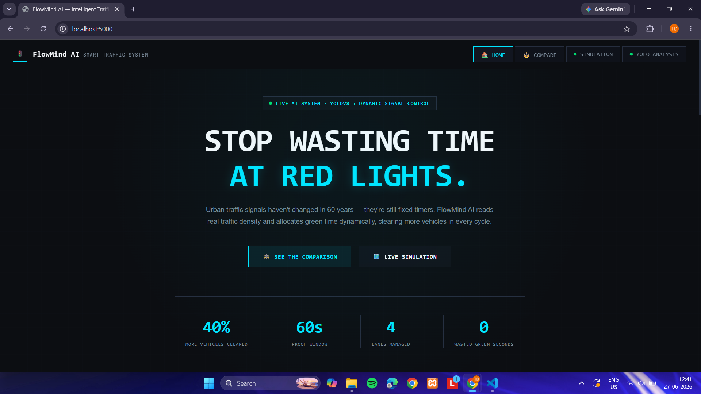

# 🚦 Smart City Traffic Management System

An AI-powered Smart City Traffic Management System built using **Python**, **Flask**, **OpenCV**, and **YOLOv8**. The application combines real-time vehicle detection, adaptive traffic signal simulation, congestion analytics, and an interactive dashboard into a single web application.

Designed as an educational and portfolio project, the system demonstrates how computer vision and traffic simulation can be integrated to create an intelligent traffic management solution without relying on paid APIs or cloud services.

---

# ✨ Features

* 🚗 Real-time vehicle detection using YOLOv8
* 📹 Support for multiple traffic video feeds
* 🚦 Adaptive traffic signal simulation
* 🚑 Emergency vehicle priority override
* 📊 Live analytics dashboard
* 📈 Traffic comparison and congestion metrics
* 🌐 Single-page Flask web application
* ⚡ Runs completely on local hardware

---

# 📸 Landing Page

Modern landing page introducing the system and highlighting key metrics.

<p align="center">

</p>

<p align="center">

</p>

<p align="center">

</p>

<p align="center">

</p>

---

# 🎥 Traffic Simulation

The simulation engine visualizes vehicle movement, adaptive traffic lights, congestion, and emergency vehicle prioritization in real time.

<p align="center">
  
</p>

---

# 📊 Traffic Comparison Dashboard

Compare traffic density, congestion levels, and analytics across multiple lanes.

<p align="center">

</p>

---

# 🤖 YOLO Vehicle Detection

Real-time AI vehicle detection powered by YOLOv8.

Features include:

* Vehicle Detection
* Vehicle Counting
* Lane Monitoring
* Live Bounding Boxes
* Traffic Density Estimation

<p align="center">

</p>

---

# 🏗 Project Architecture

```text
Sample Videos
      │
      ▼
YOLOv8 Detection Engine
      │
      ▼
Vehicle Counts
      │
      ▼
Traffic Simulation Engine
      │
      ▼
Adaptive Signal Controller
      │
      ▼
Flask Backend
      │
      ▼
Interactive Dashboard
```

---

# 📂 Project Structure

```text
smart-city-traffic-management/
│
├── app.py
├── sim_engine.py
├── yolo_engine.py
│
├── templates/
│   └── index.html
│
├── sample_videos/
│
├── static/
│   ├── image.png
│   ├── image copy.png
│   ├── image copy2.png
│   ├── image copy3.png
│   ├── image copy4.png
│   ├── image copy5.png
│   └── ...
│
├── simulation-demo.mp4
├── requirements.txt
└── README.md
```

---

# ⚙️ Installation

Clone the repository

```bash
git clone https://github.com/yourusername/smart-city-traffic-management.git
cd smart-city-traffic-management
```

Create a virtual environment

### Windows

```bash
python -m venv venv
venv\Scripts\activate
```

### Linux / macOS

```bash
python3 -m venv venv
source venv/bin/activate
```

Install dependencies

```bash
pip install -r requirements.txt
```

---

# ▶️ Run the Project

```bash
python app.py
```

Open your browser:

```text
http://127.0.0.1:5000
```

---

# 🛠 Technology Stack

### Backend

* Python
* Flask
* Flask-SocketIO

### Computer Vision

* OpenCV
* Ultralytics YOLOv8

### Frontend

* HTML
* CSS
* JavaScript

### Communication

* Socket.IO

---

# 🚀 Future Improvements

* Multi-camera monitoring
* Reinforcement learning traffic optimization
* Live CCTV integration
* Database support
* Historical analytics
* Automatic accident detection
* Smart parking integration
* IoT sensor support

---

# 📄 License

This project is intended for educational, research, and portfolio purposes.

---

# 👨‍💻 Author

Developed as a demonstration of AI-assisted Smart City Traffic Management using **Python**, **Flask**, **YOLOv8**, **OpenCV**, and real-time traffic simulation.
